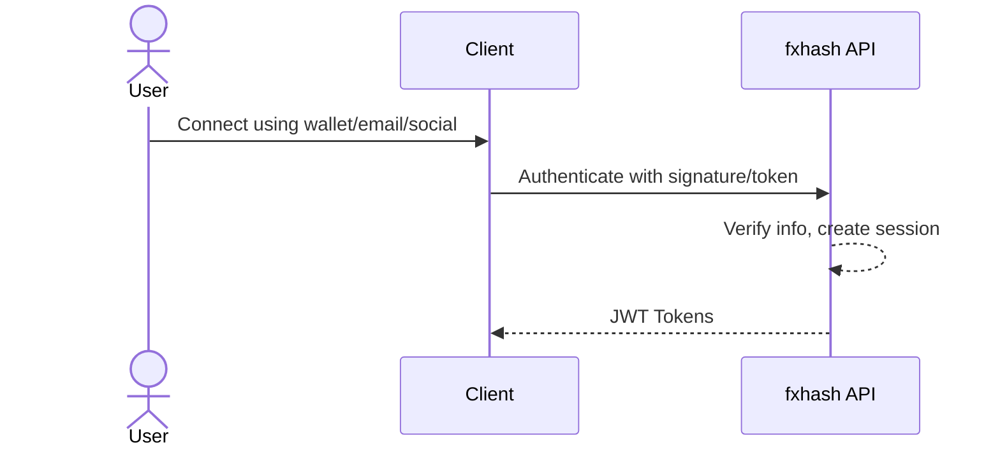
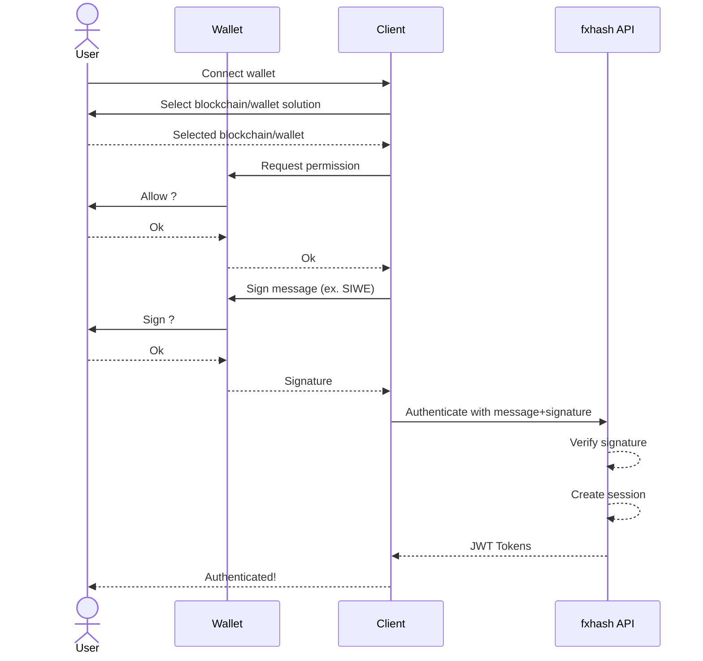
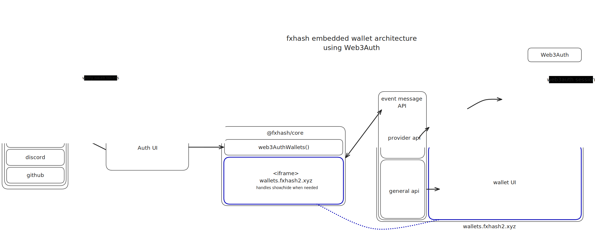
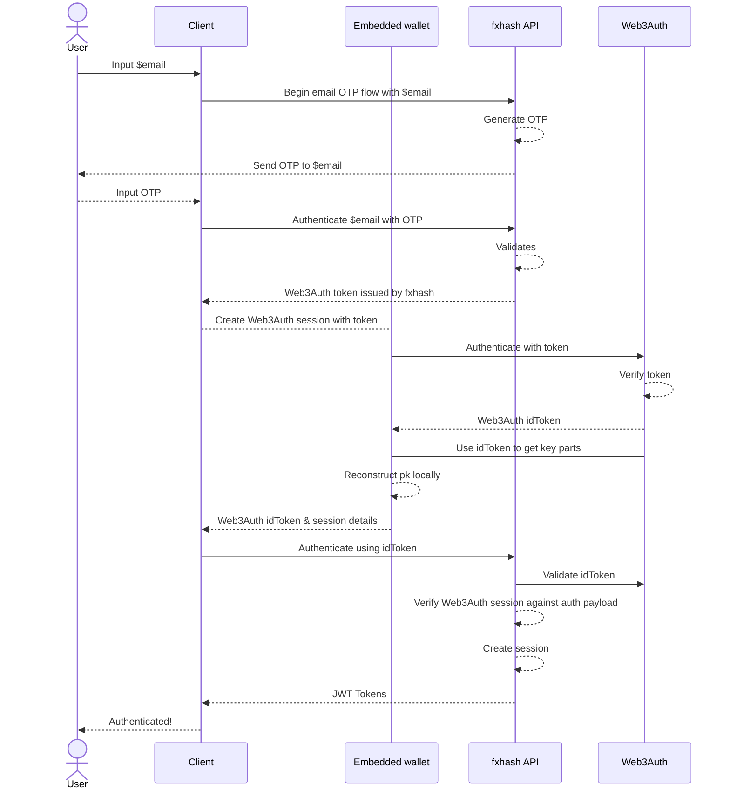
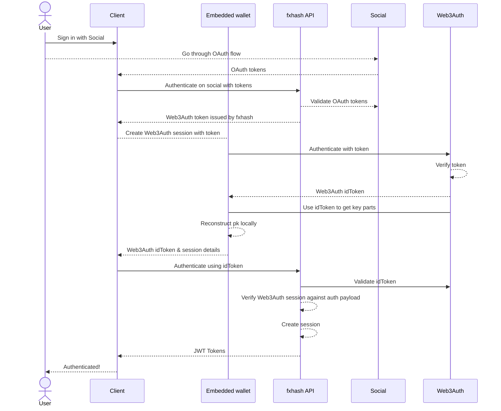

# User accounts & authentication

On fxhash, some of the features we provide require storing user data _off-chain_ or require the ability for our backend application to verify a wallet ownership. This implies that some fxhash-backend authentication needs to be in place.

Some of these features include user profile, gathering user data securely (in the context of shipping physical objects for instance), storing temporary data (when working on a project), linking wallets on different chains under a single account, or even signing in with email or socials.

Moreover, we aim for this SDK used by 3rd parties to provide feature-parity with the main platform. As such, we implemented an open authentication system allowing your applications to access such features for your users.

## Authentication flows

Let's quickly look into our authentication flow so that you can get familiar with how it works.



This is your typical authentication flow.

However, as we provide various authentication strategies, we support different variants of this flow, which we introduce next. **Please not that we describe these flows for information, which are implemented by our SDK—as a consumer of the SDK you will only face higher level APIs.**

### Wallet in user-custody

Your typical blockchain-wallet authentication strategy.



- `1-11`: The user connects their wallet of choice, and is immediately prompted with a message signature to verify their wallet ownership on our backend. The message to be signed follows strict specifications so that wallets can properly display the signature request, ensuring the user can trust it and sign. This is a common _web3_ flow
- `12-16`: Our backend verifies the signature against the message, and if valid connects the user (creating an account if needed) by storing a session and returning JWT tokens which can be used to authenticate further requests.

### fxhash embedded wallet

We provide a solution to let blockchain-uneducated users sign in with their email/socials to generate a simple zero-install multichain wallet which will be embedded in the webpage using an iframe. We implemented this solution to solve our use-case (we couldn't find any Wallet-as-a-Service compatible with Eth & Tez which suited our needs) on top of [Web3Auth](https://web3auth.io/), an estalished decentralized solution for handling wallet generation with low-level primitives.

Using this solution, users can go through a familiar _web2_ authentication flow and yet have access to a simple wallet solution to tip their toes into the blockchain ecosystem.

Let's look at a diagram of the different components:

[](./web3auth-embedded-wallets-diagram.svg)

The wallet is handled by a separate and isolated application `https://wallets.fxhash2.xyz`, which communicates with the main frame using a strict communication protocol implemented by our SDK. This application is responsible for authenticating users against Web3Auth using a fxhash-provided idToken (which is generated by going through an email/social signin flow). It handles maintaining such a session with Web3Auth and uses its SDK to reconstruct the keys locally in the iframe context using shards distributed on Web3Auth decentralized network.

The `wallets.fxhash2.xyz` frame exposes some RPC endpoints for common ethereum & tezos wallet requests. These endpoints are exposed through the communication protocol introduced before, and our SDK implements some interfaces so that known libraries we use can interface with the embedded iframe as it would with any other wallet extension.

When some user input is required (for signing a message / accepting a transaction), a request is made to the iframe which generates a UI to display information about the operation, and instructs the main application to show the iframe to the user. The user can accept/reject the request, which is then wired through the RPC protocol and is processed by our SDK just like any other regular wallet-extension request.

We support the following options for signing in:

- email with OTP validation
- social providers
  - google
  - discord
  - github

### Email

::: tip
See [Wallet options: \<iframe\> embedded wallet](./wallet-options.md#iframe-embedded-wallet) for technical details about the underlying wallet solution.
:::



This flow requires some extra steps as a secure embedded wallet iframe is used for handling the authentication with Web3Auth to reconstruct the private key. However, from a user perspective this flow is actually as simple as the wallet one, with the advantage of only needing an email address.

### Social provider

::: tip
See [Wallet options: \<iframe\> embedded wallet](./wallet-options.md#iframe-embedded-wallet) for technical details about the underlying wallet solution.
:::



This flow is similar to email sign in, except for the very first steps. Arguably this is the easiest solution for onboarding users, at some cost for wallet ownership and decentralisation.

::: info
In the future we are planning to implement flow for transferring a Web3Auth wallet to a self custody one, to improve the security of assets. However in the meantime this solution provides a frictionless and secure-enough solution for blockchain-uneducated users.
:::

## Authentication is optional!

::: warning
The authentication layer is optional and only required for a subset of the features we provide. The SDK APIs provide simple ways for you to customize this behaviour (and even more complexe ones in case you would want)
:::

Example using `@fxhash/client`:

```ts
import { createClient } from "@fxhash/client" // or from "@fxhash/sdk"

createClient({
  metadata: {
    /* ... */
  },
  wallets: {
    /* ... */
  },

  // simply setting this boolean to true will instruct the client to connect
  // the wallets defined above to the fxhash authentication layer in a
  // transparent way for you.
  authentication: true,
})
```

::: info
The authentication layer is implemented by the [**`@fxhash/core`**](../packages/core/) package, and built in a modular way. You can read more information on the underlying implementation in its doc.
:::
