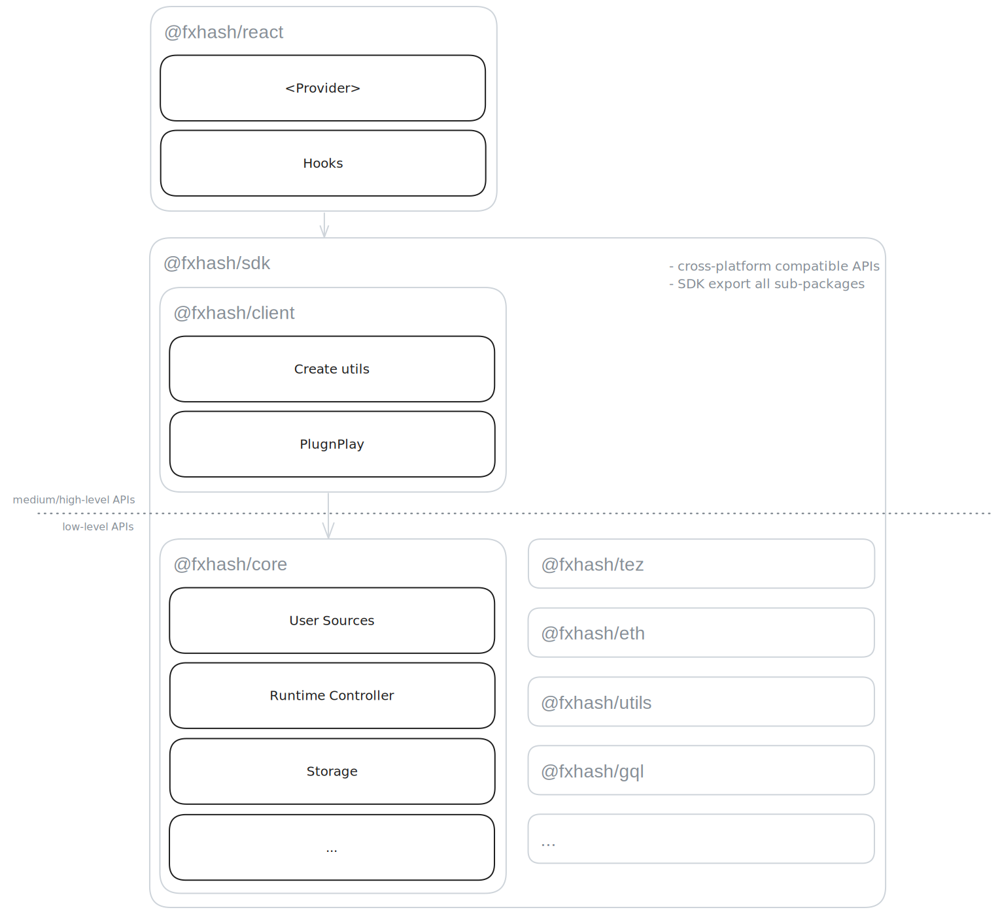

# Getting started

> [!NOTE] Hey 👋
> Welcome to the fxhash SDK documentation; you will find here all the resources you need to implement your own applications on top of fxhash.

## What is the fxhash SDK ?

The fxhash SDK is a collection of utility packages providing low-to-high level APIs for interacting with the various components of the fxhash stack. We designed it with **modularity**, **robustness** and **simplicity** as principles. We wanted to provide APIs which would suit the wide range of projects integrating fxhash, from simple showcases to fully-customized minting interfaces built by artists with unique ideas.

As such, we designed the SDK with layers of abstractions, starting with low level modular imperative APIs aggregated by simpler high level ones such that regardless of your use case, there will always be a way to achieve what you're trying to do.

## SDK architecture

At the root, there are low-level functionnal APIs. These APIs are designed as modular building blocks which work independantly but are also meant to be hooked together for building more advanced features.

On top of that, we provide a declarative API which allows instanciating the low-level building blocks using an unambiguous configuration object. These APIs are packaged in [`@fxhash/client`](../packages/client/README.md).

The low-level APIs and the `@fxhash/client` are bundlded together in the [`@fxhash/sdk`](../packages/sdk/README.md), which exposes all of their APIs so that you only have to import a single package into your application, greatly simplifying your initial development as well as iterations on your project.

Finally, we also expose framework-specific packages, which act as a wrapper arround `@fxhash/sdk` by providing APIs as expected by such frameworks. For now, we only support react at this level, with [`@fxhash/client-react`](../packages/client-react/README.md).

## Navigating this doc

### Doc structure

At the root of the documentation, you will find articles covering general concepts. For most cases, this should be enough for what you need to implement.

In addition, this main documentation aggregates the doc of each individual package. These sub-documentations are often referenced in the high-level guides if you need to go deeper. API references are also automatically generated from the codebase, which are exposed in each package section (`packages/{package}/reference`).

### Find what you need

We wrote this documentation so that it can be explored in 2 ways:

- **By use-cases**: we documented the most common use-cases by providing **guides with examples** so that you can quickly pick up our SDK. This is the recommended way as it is likely for your use case to already be documented. You can find these use-cases in the [Use cases section](../use-cases).
- **By feature**: if you are looking for specific features, you can find a list in the [Features section](./features.md), pointing to the relevant package/doc.

> [!TIP]
> More generally, we also recommend glancing through the [Concepts section](../concepts) to build knowledge and awareness on the best practices working with our SDK.
