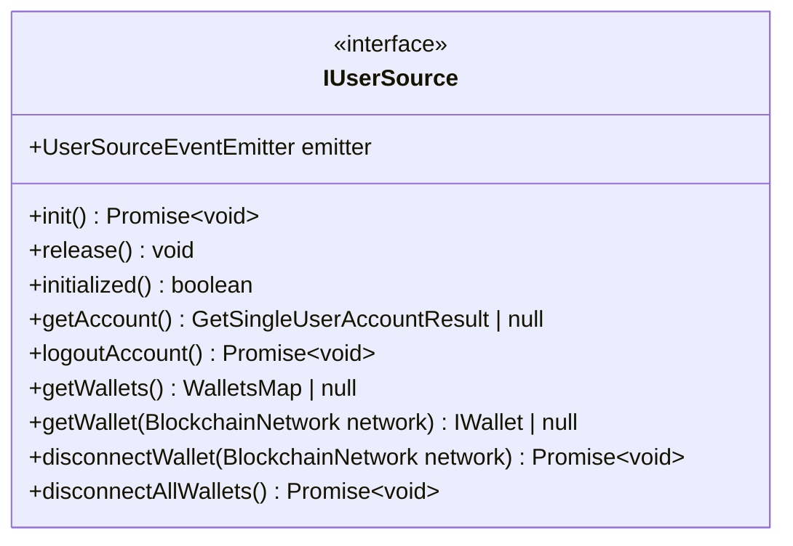
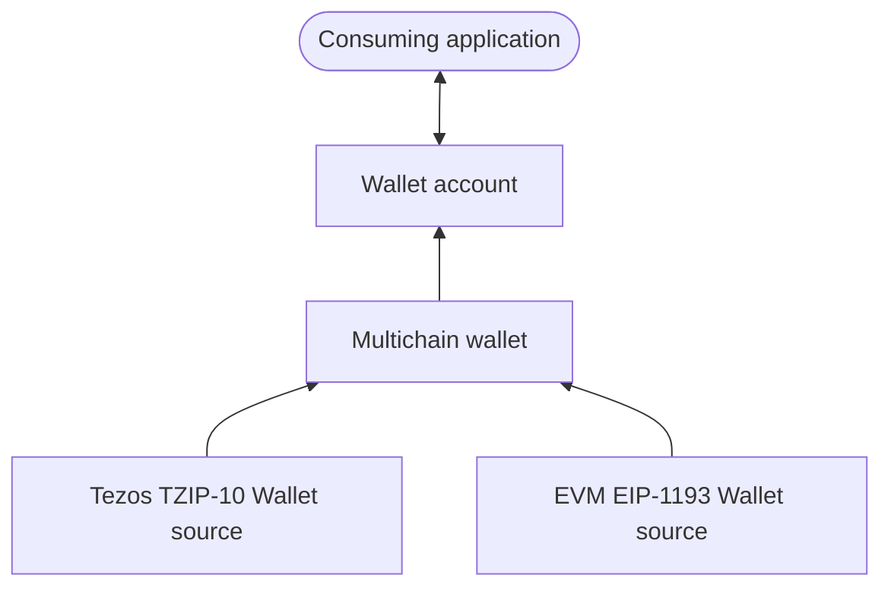
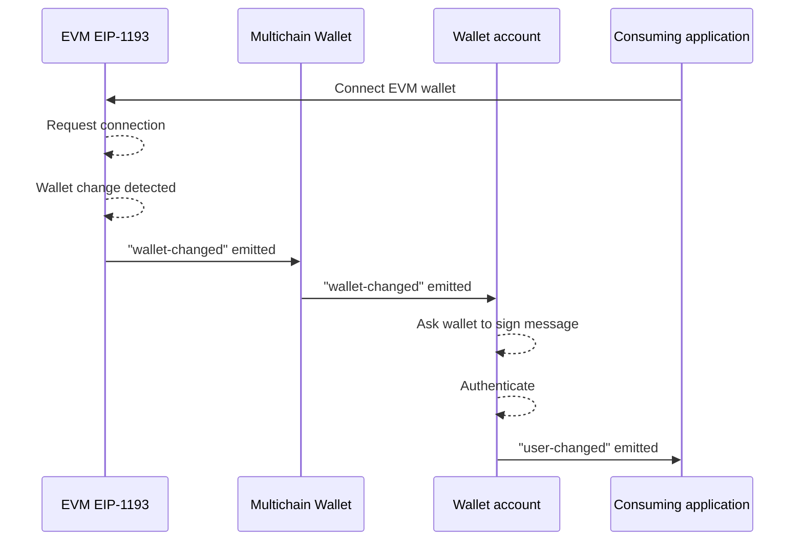

# User sources

User sources provide a unopiniated, non-intrusive & modular approach for handling users and their wallets/accounts.

## Context

There are many challenges involved in handling multiple sources of wallets (browser extensions, email/social signin, ...) on multiple blockchains, while providing a robust authentication layer:

- different wallet solutions/libraries will provide different APIs
- unifying client state (local wallet connection) with backend authentication is tricky: 2 distinct states with many side-effects (specifically wallets) which need to be reconciliated into a single coherent state
- handling multiple simultaneous wallet sources (on different chains)
- different applications have different user requirements, as such there cannot be a single monolithic wallet/account implementation
- applications may already have some wallet/account implementation, the fxhash library should have the ability to be plugged to the existing solution without impacting it, using industry standards

`@fxhash/core` aims at addressing these challenges.

## Architecture of the solution

### `IUserSource`

The first abstraction on which our solution is built upon is `IUserSource`: a generic _catch-all_ interface which is shared between all the user sources, exposing a unified event-driven API to consumers.

::: info
Any user source **MUST** implement this interface, even if they don't provide support for some of the features. For instance, wallet sources don't provide account-related features, as such `getAccount()` will always return `null`, and `logoutAccount()` won't do anything. The interface accounts for this behaviour.
:::

### Data flow: `UserSourceEventEmitter`

In a context where user sources are subject to many external side-effects, we opted for an event-driven approach, which exposes unified events during source lifecycles.

The following events may be emitted:

- `wallets-changed`: one or more wallet has been connected/disconnected
- `account-changed`: account has been connected/disconnected
- `user-changed`: a whole user state has changed (wallet+account); this event is used to provide consumers with a hook to get a coherent user state from a source
- `error`: an error was emitted (fxhash SDK errors are strongly typed, as such this event can be used to hook into very specific events easily)

When connecting modules together, modules hook into the events emitted by other modules based on how they were connected & how they are supposed to interact together. Events might be passed along, or some effects might be triggered as a result of an event emitted. **This is what allows composability**: as long as a module emits certain events it can be connected to a compatible module regardless of its internal implementation.

Consider the following example for illustration purposes:

In this example, if an EIP-1193 wallet event happens in the window, it would trigger the following sequence of events:

This example demonstrates how the application interfaces with user sources and how a proper **graph of carefully connected user sources** result in a simple and straightforward implementation at the application level. This design also ensures that the application doesn't have to care about authentication, state consistency, etc... and can safely delegate these complexe tasks to `@fxhash/core`.

This example also showcases why `@fxhash/core` is considered to be a _low-level_ package: it requires a good understanding of every module to implement a proper solution.

### References

- [**`IUserSource`**](../reference/interfaces/IUserSource)
- [**`UserSourceEventEmitter`**](../reference/classes/UserSourceEventEmitter)

## What's next

- Explore the different user sources available
  - [Wallets](./wallets.md)
  - [Accounts](./accounts.md)
  - [Multiple user sources](./multiple-sources.md)
- Explore use-case examples
  - TODO
- [Extend with your own user sources](./extend.md)
