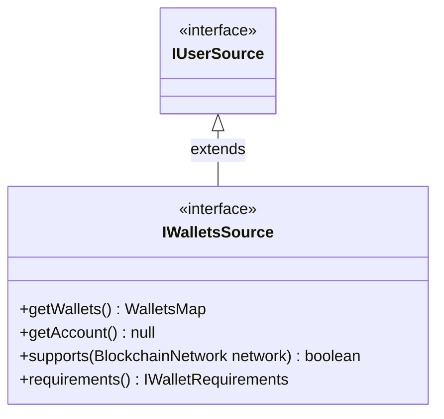

# Wallet sources

::: tip
Before reading this page we recommend reading through the [User sources main page](../)
:::

## Overview

### Interface

All the wallet sources implement a shared interface, which extends [**`IUserSource`**](./#iusersource) (as such any wallet source is also a valid user source and can be used whenever a user source is required).



Notably:

- `getWallets()` overrides `IUserSource`, enforcing a wallet source **MUST** return a `WalletsMap`
- `getAccount()` overrides `IUserSource`, enforcing a wallet source **MUST** return `null`; ie a wallet source will never return an account
- `supports()` and `requirements()` provide an interface for consumers to query information about the wallet source (without having to know about the kind of wallet source it is)

### `WalletsMap` and `WalletManager`

Wallet sources are required to return `WalletsMap`, which provides information about the current state of the wallets connected. The interface is defined as follows:

```ts
// imported from @fxhash/shared
enum BlockchainNetwork {
  TEZOS = "TEZOS",
  ETHEREUM = "ETHEREUM",
}

type WalletsMap = {
  [N in BlockchainNetwork]?: IWallet
}

/**
 * Abstract interface representing a Wallet. This data may be returned by
 * Wallet Sources to describe the current state of a wallet on a given network.
 */
interface IWallet {
  /**
   * The Wallet currently connected. If null, the wallet isn't connected.
   */
  connected: IWalletConnected | null

  /**
   * The Wallets Source which handles this Wallet.
   */
  source: IWalletsSource
}

/**
 * Information and Wallet Manager instance of a wallet currently connected.
 */
interface IWalletConnected {
  manager: EthereumWalletManager | TezosWalletManager
  info: {
    address: string
  }
}
```

::: info Note
These interfaces have been simplified for the purpose of this documentation. These are actually typed with generics based on the blockchain, so that you get exact typing when interfacing with it. You can see the actual [WalletsMap type here](../reference/type-aliases/WalletsMap.md).
:::

When a wallet connection is established, a `WalletManager` on the associated blockchain is instanciated. Wallets Managers are an abstraction used by the fxhash SDK to interact with wallets using a shared interface. The `WalletManager` is not implemented by this package, however this package is responsible for instanciating a `WalletManager` whenever a wallet can be used. Other parts of the fxhash SDK will rely on this `WalletManager` interface for various tasks, facilitated by such interface.

There are 2 kinds of `WalletManager`:

- **`EthereumWalletManager`**: for EVM chains
- **`TezosWalletManager`**: for Tezos

If you want to learn more about the wallet managers, you can look into their respective packages.

### References

- [**`IWalletsSource`**](../reference/interfaces/IWalletsSource.md)
- [**`WalletsMap`**](../reference/type-aliases/WalletsMap.md)
- [**`WalletManager`**](../../shared/reference/classes/WalletManager)
- [**`EthereumWalletManager`**](../../eth/reference/classes/EthereumWalletManager)
- [**`TezosWalletManager`**](../../tez/reference/classes/TezosWalletManager)

## Wallet sources available

- Window Wallets
- Private Key Wallets
- Web3Auth Wallets
