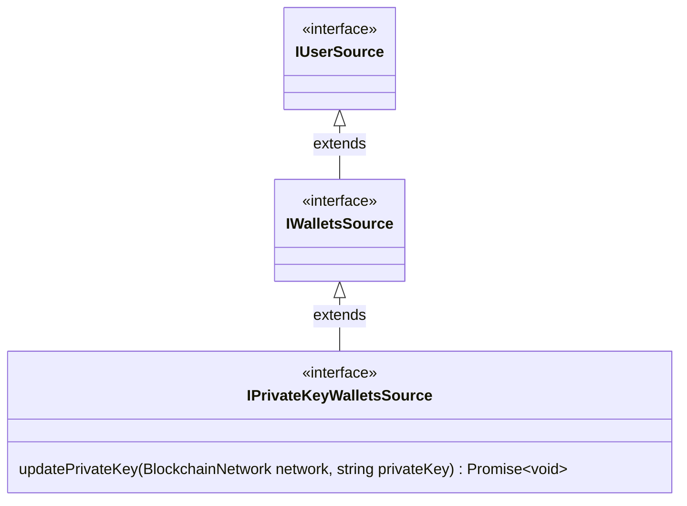

# Private key wallets

Private key wallets allow instanciating a wallet using a raw private key. The wallet key will be stored **in-memory** and operations will be signed on the application directly.

::: danger ⚠️ DANGER
Private key wallets should only be used for local tests or in a secure server environment. **If a private key is exposed then the wallet can be considered compromised.**
:::

## Shared interface

Private key wallets **MUST** implement a `IPrivateKeyWalletsSource` interface:



### `updatePrivateKey(network, privateKey)`

### Parameters

#### network

`BlockchainNetwork`

The blockchain on which the private key should be updated. If the `IPrivateKeyWalletsSource` doesn't support the provided blockchain, an error will be thrown.

#### privateKey

- `string` on `BlockchainNetwork.TEZOS`
- `Hex` on `BlockchainNetwork.ETHEREUM`

A valid private key to update the wallet source with. If the key is invalid, an error will be thrown.

### Return type

`Promise<void>`

A promise which resolves when the private key has been updated and after the whole emission chain has resolved (when the event has been propagated).

## `evmPrivateKeyWallet`

This function can be instanciated with a valid private key as a hexadecimal literal string. If the private key is specified, when `init()` is called the wallet will be initialized with such private key. Otherwise no signer will be available until `updatePrivateKey()` is called.

### Examples

```ts
import { evmPrivateKeyWallet } from "@fxhash/core"

async function init() {
  const walletSource = evmPrivateKeyWallet({
    privateKey: "0x...",
  })
  await walletSource.init()

  const walletManager = walletSource.getWallet(BlockchainNetwork.ETHEREUM)
    .connected.manager
  const result = await walletManager.sendTransaction(/*...*/)
}
```

## `tezosPrivateKeyWallet`

This function can be instanciated with a valid private key as a string. If the private key is specified, when `init()` is called the wallet will be initialized with such private key. Otherwise no signer will be available until `updatePrivateKey()` is called.

### Examples

```ts
import { tezosPrivateKeyWallet } from "@fxhash/core"

async function init() {
  const walletSource = tezosPrivateKeyWallet({
    privateKey: "edsk...",
  })
  await walletSource.init()

  const walletManager = walletSource.getWallet(BlockchainNetwork.TEZOS)
    .connected.manager
  const result = await walletManager.sendTransaction(/*...*/)
}
```

## `privateKeyWallets`

This function wraps `evmPrivateKeyWallet` and `tezosPrivateKeyWallet` and provides a unified `IPrivateKeyWalletsSource` interface. `privateKeyWallets` uses [`multichainWallets`](../multiple-sources.md#multichain-wallets) internally (a generic wrapper to merge multiple wallet sources from different chains together).

### Example

```ts
async function init() {
  const wallets = privateKeyWallets({
    evm: {
      privateKey: "0x...",
    },
    tezos: {
      privateKey: "edsk...",
    },
  })
  await wallets.init()

  // get eth/tez wallet
  const evmWallet = wallets.getWallet(BlockchainNetwork.ETHEREUM)
  const tezWallet = wallets.getWallet(BlockchainNetwork.TEZOS)
}
```

Notably, `evm` and `tezos` keys in the options object are optional, if a key isn't defined the related wallet source won't be instanciated.

```ts
// only an EVM wallet will be instanciated
const wallets = windowWallets({
  evm: {
    privateKey: "0x...",
  },
})
```

::: info
For more information please look into the [`multichainWallets()`](../multiple-sources.md#multichain-wallets) doc.
:::

## References

- [**`IPrivateKeyWalletsSource`**](../../references/interfaces/IPrivateKeyWalletsSource.md)
- [**`evmPrivateKeyWallet`**](../../references/functions/evmPrivateKeyWallet.md)
- [**`tezosPrivateKeyWallet`**](../../references/functions/tezosPrivateKeyWallet.md)
- [**`privateKeyWallets`**](../../references/functions/privateKeyWallets.md)
