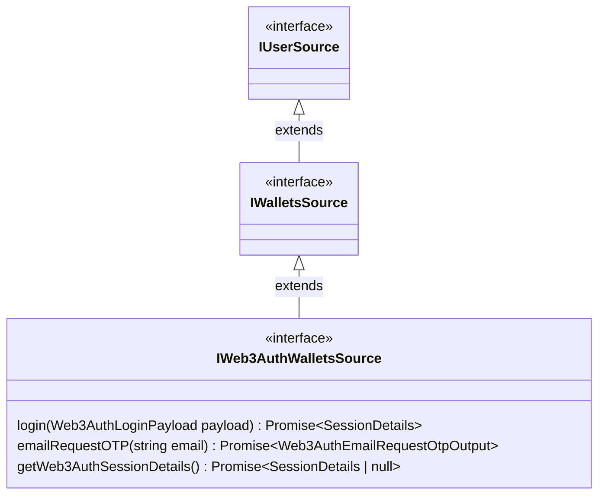

# Web3Auth wallets

We provide a solution to let blockchain-uneducated users sign in with email/socials to generate a simple zero-install multichain wallet.

::: tip LEARN MORE
You can learn more about our [embedded solution in this document](/concepts/user-account-authentication#fxhash-embedded-wallet).
:::

This package provides an implementation of this solution on the client-side, seamlessly integrated with the rest of the SDK.

## Interface



::: warning
IWeb3AuthWalletsSource interface was slightly simplified for lisibility. See [IWeb3AuthWalletsSource interface](../../reference/interfaces/IWeb3AuthWalletsSource.md).
:::

### `login(payload)`

Authenticate the fxhash embedded iframe against Web3Auth using the provided credentials.

### Parameters

#### payload

`Web3AuthLoginPayload`

```ts
type Web3AuthLoginPayload =
  | {
      method: "email"
      options: {
        email: string
        otp: string
      }
    }
  | {
      method: "oauth"
      options: {
        provider: "google" | "discord"
        token: string
      }
    }
```

### Return type

```ts
type Return = PromiseResult<
  SessionDetails | null,
  WithIframeErrors<Web3AuthFrameError["login"]>
>
```

A promise which **always** resolves with a result containing the `SessionDetails` in case of success or a typed error in case of failure.

Error can be:

- `Web3AuthFrameAuthenticationError`
- `Web3AuthFrameFxhashAuthenticationError`
- `Web3AuthFrameUnknownError`
- Iframe error (not related to the operation but to the iframe communication instead)
  - `IframeRequestTimeoutError`
  - `IframeDisconnectedError`
  - `ConnectionAlreadyEstablishedError`
  - `IframeUnsupportedRequestError`
  - `UnexpectedRichError`

::: info
This function doesn't implement the whole authentication flow, if you are looking for a full working example [TOOD](TODO).
:::

### `emailRequestOTP(email)`

Request a One-Time Password (OTP) for a given email. The OTP will be sent to the email by fxhash backend and will be valid for roughly 5 minutes. The OTP can then be used to login to Web3Auth using the `login()` function.

### Parameters

#### email

`string`

### Return type

```ts
type Return = PromiseResult<
  Web3AuthEmailRequestOtpOutput,
  WithGqlErrors<EmailOTPRequestError>
>

type Web3AuthEmailRequestOtpOutput = {
  attemptsLeft: number
  email: string
  expires: string
}
```

A promise which **awlays** resolves with a result containing the OTP request details in case of success, or an error in case of failure.

Error can be:

- `EmailOTPLockedError`
- or a GraphQL error:
  - `NetworkRichError`
  - `UnexpectedRichError`

### `getSessionDetails()`

Returns the details of the Web3Auth session currently authenticated in the fxhash embedded iframe.

### Return type

```ts
type Return = PromiseResult<
  SessionDetails | null,
  WithIframeErrors<Web3AuthFrameError["getSessionDetails"]>
>
```

A promise which **always** resolves with:

- if success:
  - `SessionDetails`: **Authenticated** Web3Auth session details
  - `null`: No session currently authenticated
- if error:
  - `Web3AuthFrameAuthenticationError`
  - Iframe error (not related to the operation but to the iframe communication instead)
    - `IframeRequestTimeoutError`
    - `IframeDisconnectedError`
    - `ConnectionAlreadyEstablishedError`
    - `IframeUnsupportedRequestError`
    - `UnexpectedRichError`

## `web3AuthWallets()`

This function instanciates a Web3Auth wallet source, which provides utilities to sign in using email/socials and exposes an evm and tezos wallet. When the `init()` function of the object returned is called, the fxhash embedded wallet page will be loaded in a `<iframe>` and a communication with such frame will be opened.

The iframe handles Web3Auth account management & session, and provides an interface for signing messages & transactions. By default the iframe is hidden however when the wallet requires to display some user feedback or some input from the user, it will be displayed over the whole document.

The utility functions provided by `web3AuthWallets()` offer a simple interface with fxhash APIs related to authentication with Web3Auth, as well as the iframe. Moreover, it provides a wallet implementation abstracting the communication protocol with the iframe such that a general-purpose WalletManager is made available.

### Examples

#### Setup Web3Auth wallets source

```ts
import { GraphQLWrapper, web3AuthWallets } from "@fxhash/core"

const wallets = web3AuthWallets({
  gqlWrapper: new GraphQLWrapper(),
})

wallets.emitter.on("wallets-changed", payload => {
  console.log(payload)
})

async function init() {
  await wallets.init()
}
```

#### Login with google

```ts
import { GraphQLWrapper, web3AuthWallets } from "@fxhash/core"

const wallets = web3AuthWallets({
  gqlWrapper: new GraphQLWrapper(),
})

wallets.emitter.on("wallets-changed", payload => {
  console.log(payload)
})

async function init() {
  await wallets.init()

  // here we imagine having a google OAuth token after successfully performing
  // the oauth flow (which is out of the scope of this package)
  const googleOAuthToken = "..."

  wallets.login({
    method: "oauth",
    options: {
      provider: "google",
      token: googleOAuthToken,
    },
  })
}
```

### Notes

#### Notes on authentication

This function will establish a session with Web3Auth through the iframe, and while it requires the fxhash API for validation it won't create an authenticated session with fxhash. If you use this module in standalone, the wallet won't be authenticated on fxhash API.

There are 2 ways to provide such authentication:

- (**Highly recommended**) Using the `authWeb3Auth()` wrapper, which uses the Web3Auth session details to authenticate against fxhash backend
- Using the generic `authWallets()` wrapper, which will prompt the user to sign messages with the embedded iframe wallet (adding an extra step for the authentication)

#### Notes for front-end frameworks (React, Vue, Angular, ...)

This library injects a `<iframe>` into the `document.body` of the page. It's possible that because sometimes `document.body` is a part of your component tree, then such framework might remove every DOM element which isn't a part of the tree when `body` is re-rendered (which can happen quite often if there is some top-level state).

We implemented a hack for react which should get around this issue, but as any hack it might break in some edge case context. In case the `<iframe>` still gets removed from the DOM, a warning is issued to the dev so that the issue can be fixed.

The function `init()` **MUST ALWAYS** be called **once the DOM is finishialized**, otherwise it may produce unexpected behavious.

TODO limitations
