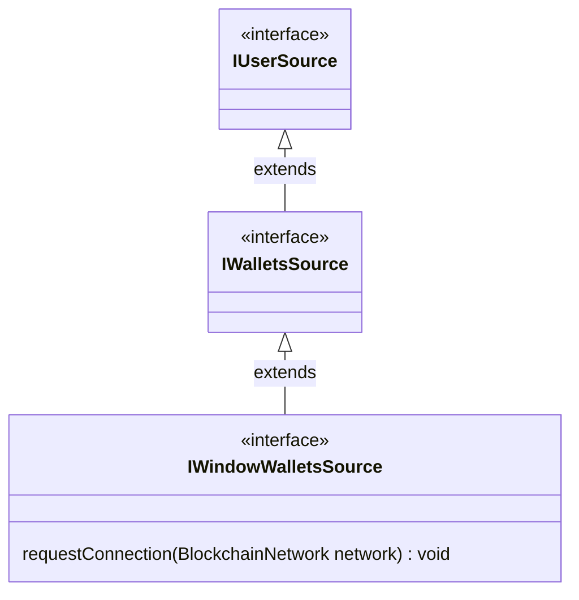

# Window wallets

Window wallets are covering support of wallets as browser-extensions; more specifically [EIP-1193](https://eips.ethereum.org/EIPS/eip-1193) on EVM chains and [TZIP-10](https://tzip.tezosagora.org/proposal/tzip-10/). Most of these wallet solutions are injecting themselves into web documents, which is how web apps can know about these and eventually initiate communication.

We specifically designed these modules to be non-intrusive: as we expect some consumers of `@fxhash/sdk` to have their own wallet implementations, we didn't want this module to fight against it. These modules hook themselves into the events emitted by wallets following the specs mentionned above. It is still possible to use the `requestConnection` to initiate the wallet connection from these modules. So instead of handling the whole wallet lifecycle, these modules provide various features allowing wallet handling to be either managed or delegated to the application.

## Shared interface

Window wallets **MUST** implement a `IWindowWalletsSource` interface:



Moreover, the APIs and implementations of the EVM & TEZ window sources are similar, ensuring common patterns between these 2 chains.

## `eip1193WalletSource`

This function expects a WAGMI config as argument, attaches some listeners on the `window.ethereum` object based on the provided config and returns an object implementing the `IWindowWalletsSource` interface. Whenever a listener catches a event related to an account change, it synchronizes its internal state (by setting the account address & instanciating an `EthereumWalletManager`) and emits `wallets-changed`.

### About WAGMI

This module uses [`@wagmi/core`](https://wagmi.sh/core/why) for EVM wallet client management, which is the current industry standard when it comes to managing a wallet client in a web app. As such, you are required to provide a WAGMI config when calling `eip1193WalletSource()`. We provide an utility function `fxWagmiConfigOptions()` which returns a list of options allowing the fxhash SDK to work properly on all the stack supported by fxhash, however you are free to provide your own WAGMI config if already implemented by your app.

### Examples

If your app already implements a wallet solution using WAGMI:

```ts
import { yourWagmConfig } from ".."
import { eip1193WalletSource } from "@fxhash/core"

async function init() {
  const evmSource = eip1193WalletSource({
    wagmiConfig: yourWagmiConfig,
  })
  evmSource.emitter.on("wallets-changed", payload => {
    // do something with {payload} when wallet change is detected
  })
  await evmSource.init()
}
```

If your app doesn't have ny wallet solution in-place:

```ts
import { eip1193WalletSource, fxWagmiConfigOptions } from "@fxhash/core"

async function init() {
  const evmSource = eip1193WalletSource({
    wagmiConfig: fxWagmiConfigOptions({
      metadata: {
        name: "Your app name",
        description: "Your app description...",
        url: "http://your-website-url.com",
        icon: "http://your.icon/icon.png", // optional
      },
    }),
  })
  evmSource.emitter.on("wallets-changed", payload => {
    // do something with {payload} when wallet change is detected
  })
  await evmSource.init()
}
```

Optionally, you can use this wallet source to request the user for a connection of their wallet:

```ts
import { eip1193WalletSource } from "@fxhash/core"
import { BlockchainNetwork } from "@fxhash/shared"

async function init() {
  const evmSource = eip1193WalletSource(/* ... */)
  await evmSource.init()
  // example of a connection request
  yourConnectButton.addEventListener("click", () => {
    evmSource.requestConnection(BlockchainNetwork.ETHEREUM)
  })
}
```

## `tzip10WalletSource`

This function expects a Beacon config as argument, attaches some listeners on the window object to listen for messages sent by wallets and returns an object implementing the `IWindowWalletsSource` interface. Whenever a listener catches a event related to an account change, it synchronizes its internal state (by setting the account address & instanciating an `TezosWalletManager`) and emits `wallets-changed`.

### About Beacon

This module uses [Beacon](https://docs.walletbeacon.io/) for its implementation of TZIP-10, which is the industry standard on Tezos. Beacon supports a wide range of wallets so it's very unlikely one of your user's wallet won't be supported.

### Examples

If your app already implements a wallet solution using Beacon:

```ts
import { yourBeaconConfig } from ".."
import { tzip10WalletSource } from "@fxhash/core"

async function init() {
  const tezSource = tzip10WalletSource({
    beaconConfig: yourBeaconConfig,
  })
  tezSource.emitter.on("wallets-changed", payload => {
    // do something with {payload} when wallet change is detected
  })
  await tezSource.init()
}
```

If your app doesn't have ny wallet solution in-place:

```ts
import { tzip10WalletSource, fxWagmiConfigOptions } from "@fxhash/core"

async function init() {
  const tezSource = tzip10WalletSource({
    beaconConfig: createBeaconConfig({
      name: "Your app name",
      description: "Your app description...",
      url: "http://your-website-url.com",
      icon: "http://your.icon/icon.png", // optional
    }),
  })
  tezSource.emitter.on("wallets-changed", payload => {
    // do something with {payload} when wallet change is detected
  })
  await tezSource.init()
}
```

Optionally, you can use this wallet source to request the user for a connection of their wallet:

```ts
import { tzip10WalletSource } from "@fxhash/core"
import { BlockchainNetwork } from "@fxhash/shared"

async function init() {
  const tezSource = tzip10WalletSource(/* ... */)
  await tezSource.init()
  // example of a connection request
  yourConnectButton.addEventListener("click", () => {
    tezSource.requestConnection(BlockchainNetwork.TEZOS)
  })
}
```

## `windowWallets`

This function wraps `eip1193WalletSource` and `tzip10WalletSource` and provides a unified `IWindowWalletsSource` interface. `windowWallets` uses [`multichainWallets`](../multiple-sources.md#multichain-wallets) internally (a generic wrapper to merge multiple wallet sources from different chains together).

### Example

```ts
import { beaconConfig, wagmiConfig } from "./config"

async function init() {
  const wallets = windowWallets({
    evm: {
      wagmiConfig,
    },
    tezos: {
      beaconConfig,
    },
  })
  wallets.emitter.on("wallets-changed", evt => {
    console.log("wallets changed:", evt)
  })
  await wallets.init()

  // to request connection on tez wallet
  wallets.requestConnection(BlockchainNetwork.TEZOS)
  // alternatively
  wallets
    .getWallet(BlockchainNetwork.TEZOS)
    .source.requestConnection(BlockchainNetwork.TEZOS)
}
```

Notably, `evm` and `tezos` keys in the options object are optional, if a key isn't defined the related wallet source won't be instanciated.

```ts
// only an EVM wallet will be instanciated
const wallets = windowWallets({
  evm: {
    wagmiConfig,
  },
})
```

::: info
For more information please look into the [`multichainWallets()`](../multiple-sources.md#multichain-wallets) doc.
:::

## References

- [IWindowWalletsSource](../../reference/interfaces/IWindowWalletsSource.md)
- [eip1193WalletSource](../../reference/functions/eip1193WalletSource.md)
- [tzip10WalletSource](../../reference/functions/tzip10WalletSource.md)
- [windowWallets](../../reference/functions/windowWallets.md)
